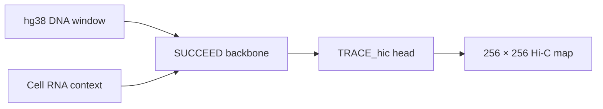

# TRACE_hic

**TRACE_hic** predicts a cell-specific Hi-C contact map from hg38 DNA sequence and one RNA-seq context. It uses a frozen **SUCCEED** DNA representation backbone with RNA conditioning and trains a shared Hi-C head across cell types.



A prediction covers a **2,097,152-bp** interval and is a **256 × 256 matrix in [0, 1]**. Values are in the model's per-window normalized domain; they are **not raw contact counts**. Inference requires DNA and RNA, not experimental Hi-C.

## What is in this repository

| Path | Purpose |
| --- | --- |
| `src/succeed_backbone/` | Frozen SUCCEED Stage-I model implementation |
| `src/trace_hic/model/` | RNA context contract, sequence adapter, and Hi-C head |
| `src/trace_hic/training/` | Multi-cell training entry point and dataset code |
| `src/trace_hic/inference/predict.py` | Label-free prediction for one genomic window |
| `src/trace_hic/preprocessing/` | RNA context and Hi-C label preparation |
| `assets/model_contract/` | Fixed 64,217-gene vocabulary and feature contract |
| `assets/regions/` | Default hg38 excluded-region BED files |
| `artifacts.json` | Weight filenames and SHA256 checksums |

This release trains the **Hi-C head with SUCCEED frozen**. It does not include a command to pretrain SUCCEED from scratch. The reference genome, RNA quantifications, Hi-C data, and model weights are not tracked by Git.

## Installation

Use Python 3.10 or newer. A CUDA-capable GPU and a matching PyTorch installation are recommended for training and prediction.

From the repository root:

```bash
python -m pip install -e .
```

The installed commands are `trace-hic-rna-context`, `trace-hic-prepare-labels`, `trace-hic-train`, and `trace-hic-predict`. Run any command with `--help` for its full options.

### Weights

Place the two trusted checkpoints at these paths:

```text
weights/stage1.pt     SUCCEED backbone
weights/stage2.ckpt   TRACE_hic head and training metadata
```

The reference Stage-II checkpoint is the epoch 20 model trained on GM12878, IMR90, H1-hESC, and K562. Check the files against [artifacts.json](artifacts.json):

```bash
sha256sum weights/stage1.pt weights/stage2.ckpt
```

The checkpoints are ignored by Git. No download URL is currently included, so a fresh clone needs the weight files supplied separately before prediction or resumed training. Training a new Hi-C head requires the Stage-I checkpoint; it does not require the reference Stage-II checkpoint.

## Prepare input data

The training data root must contain chromosome FASTAs and one RNA context plus Hi-C labels per cell:

```text
DATA_ROOT/
├── dna_sequence/
│   ├── chr1.fa.gz
│   └── ... chrX.fa.gz
├── GM12878/
│   ├── RNA/context.npz
│   └── hic_matrix_balanced_clip93/
│       ├── metadata.json
│       └── chr1.npz ... chrX.npz
├── IMR90/...
├── H1-hESC/...
└── K562/...
```

Use one hg38 reference sequence for every cell. Training uses chromosomes 1–9, 11–14, and 16–22; chromosome 10 is validation. Chromosome 15 and chromosome X are excluded from training. The supplied centromere/telomere and gap BEDs are the defaults; override them with `--centrotelo-bed` and `--invalid-regions-bed` if needed.

### 1. Convert RNA quantifications

Each input TSV needs `gene_id` and `TPM` columns. Files supplied together are replicates of one cell and one RNA protocol. The command uses the included gene vocabulary and saves a validated `context.npz`:

```bash
export TRACE_DATA_ROOT=/path/to/hg38_data
trace-hic-rna-context \
  --rna-tsv /path/to/replicate1.tsv /path/to/replicate2.tsv \
  --celltype GM12878 --rna-protocol total_rna \
  --output "$TRACE_DATA_ROOT/GM12878/RNA/context.npz"
```

`--rna-protocol` accepts `total_rna` or `polyA_plus_rna`. Repeat for each training cell. For an unseen cell at prediction time, generate its context the same way and use the same model contract.

### 2. Export Hi-C training labels

Input Hi-C must be a **10-kb Cooler** with a balancing column, `weight` by default. The exporter needs a cell-specific clipping threshold; it does not calculate one automatically. The reference model used these thresholds, as recorded in its training metadata:

| Cell type | Clip threshold |
| --- | ---: |
| GM12878 | 0.0037519999842522975 |
| IMR90 | 0.0061214187909989105 |
| H1-hESC | 0.004942839944491607 |
| K562 | 0.00429374487132937 |

For example:

```bash
trace-hic-prepare-labels \
  --cool /path/to/GM12878_10kb.cool \
  --clip-threshold 0.0037519999842522975 \
  --output-dir "$TRACE_DATA_ROOT/GM12878/hic_matrix_balanced_clip93"
```

Repeat for each cell. The exporter writes chromosome NPZ files and `metadata.json`. Training validates each label directory and applies **resize → log1p → valid-pixel window min-max** to the clipped, balanced contacts. The first two diagonals are excluded from the loss by default. These reference thresholds reproduce the recorded setup only with the corresponding source Hi-C data; use an appropriate threshold for other datasets.

## Train TRACE_hic

The following settings match the recorded four-cell run, including its effective batch size:

```bash
trace-hic-train \
  --data-root "$TRACE_DATA_ROOT" \
  --celltypes GM12878,IMR90,H1-hESC,K562 \
  --save-path results/TRACE_hic \
  --devices 4 --batch-size-per-device 6 \
  --accumulate-grad-batches 1 --succeed-tile-batch-size 2 \
  --num-workers 2 --precision bf16-mixed \
  --seed 2179 --max-epochs 80
```

Training balances the number of windows contributed by each cell, uses a shared Hi-C head, and selects checkpoints by **macro validation loss** across cells. The output directory contains `models/`, CSV training logs, a resolved configuration, and label provenance. Use `--resume-from-checkpoint PATH` to resume a run. Adjust device count and batch size for available GPU memory.

## Predict a Hi-C window

Prediction needs a chromosome FASTA, a prepared RNA context, both model weights, and the interval start. It does **not** read a Hi-C label directory:

```bash
trace-hic-predict \
  --context-npz "$TRACE_DATA_ROOT/HepG2/RNA/context.npz" \
  --fasta "$TRACE_DATA_ROOT/dna_sequence/chr15.fa.gz" \
  --chromosome chr15 --start 44000000 \
  --output outputs/hepg2_chr15_44000000.npz
```

`--start` is zero based. This example predicts `[44,000,000, 46,097,152)` on chr15. The command checks that the window fits inside the FASTA and pads the backbone's flanking sequence at chromosome boundaries. The default precision is BF16 on `cuda:0`; use `--device cpu --precision float32` if running without CUDA.

The output NPZ has two keys:

- `prediction`: `float32` array with shape `(256, 256)` and values in `[0, 1]`.
- `metadata_json`: cell type, assembly, genomic coordinates, value domain, and input/checkpoint hashes.

```python
import json
import numpy as np

with np.load("outputs/hepg2_chr15_44000000.npz", allow_pickle=False) as result:
    matrix = result["prediction"]
    metadata = json.loads(result["metadata_json"].item())
print(matrix.shape, metadata["celltype"])
```

There is no inverse transform to raw contact counts for label-free prediction: each training target used statistics from its own experimental window.

## Verification and provenance

Run the small input and checkpoint tests with:

```bash
python -m pip install -e '.[test]'
python -m pytest -q
```

The extracted project has been checked with a real K562 chr15 prediction; its matrix was identical to the pre-rename implementation for the same input and weights. Full multi-GPU training was not rerun after extraction.

The source includes components derived from the SUCCEED project and the Stage-I backbone implementation. Historical names inside the fixed model contract and checkpoint are retained because changing their bytes would invalidate RNA-context and checkpoint hash checks. **Before public redistribution, confirm permission for the extracted source and choose a repository license**; the source directories did not provide a top-level license covering these files.
